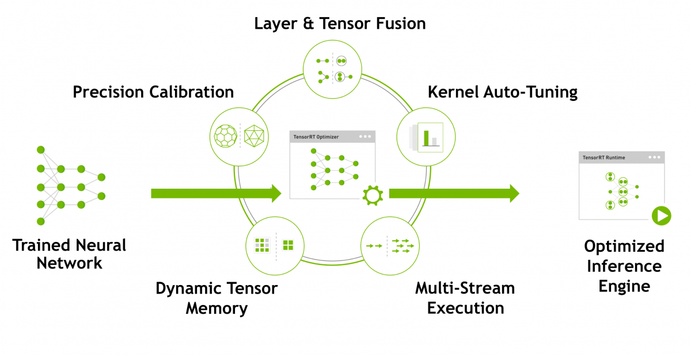

<h1>NVIDIA TensorRT™</h1>

<b>目录：</b>

*   **[1、TensorRT前言](#1、TensorRT前言)**
*   **[2、资源简介](#2、资源简介)**
*   **[3、TensorRT 优化与性能](#3、TensorRT 优化与性能)**
*   **[4、主要框架集成](#4、主要框架集成)**
*   **[5、新功能](#5、新功能)**
*   **[6、其他资源](#6、其他资源)**
*   **[7、课程资源](#7、课程资源)**
*   **[8、使用范围](#8、使用范围)**

---

## 1、TensorRT前言 ##

NVIDIA TensorRT™ 是用于高性能深度学习推理的 SDK。此 SDK 包含深度学习推理优化器和运行时环境，可为深度学习推理应用提供低延迟和高吞吐量

在推理过程中，基于 TensorRT 的应用程序的执行速度可比 CPU 平台的速度快 40 倍。借助 TensorRT，您可以优化在所有主要框架中训练的神经网络模型，精确校正低精度，并最终将模型部署到超大规模数据中心、嵌入式或汽车产品平台中。

TensorRT 以 NVIDIA 的并行编程模型 CUDA 为基础构建而成，可帮助您利用 CUDA-X 中的库、开发工具和技术，针对人工智能、自主机器、高性能计算和图形优化所有深度学习框架中的推理。

TensorRT 针对多种深度学习推理应用的生产部署提供 INT8 和 FP16 优化，例如视频流式传输、语音识别、推荐和自然语言处理。推理精度降低后可显著减少应用延迟，这恰巧满足了许多实时服务、自动和嵌入式应用的要求。

您可以从每个深度学习框架中将已训练模型导入到 TensorRT。应用优化后，TensorRT 选择平台特定的内核，在数据中心、Jetson 嵌入式平台以及 NVIDIA DRIVE 自动驾驶平台上更大限度提升 Tesla GPU 的性能。

借助 TensorRT，开发者可专注于创建新颖的 AI 支持应用，无需费力调节性能来部署推理工作。

**[下载TensorRT](https://developer.nvidia.com/nvidia-tensorrt-download)**

**[Top](#top)** - **[Bottom](#bottom)**

---

## 2、资源简介 ##

*   [**新版本有哪些新增功能**](https://developer.nvidia.com/zh-cn/tensorrt#tensorrt-whats-new)
*   [**入门博客**](https://devblogs.nvidia.com/speeding-up-deep-learning-inference-using-tensorrt/)
*   [**开发者指南**](https://docs.nvidia.com/deeplearning/sdk/tensorrt-developer-guide/index.html)
*   [**代码示例**](https://docs.nvidia.com/deeplearning/sdk/tensorrt-sample-support-guide/index.html)
*   [**Github**](https://github.com/NVIDIA/TensorRT)
*   [**预训练模型**](https://ngc.nvidia.com/catalog/models?orderBy=modifiedDESC&query=tensorrt&quickFilter=models&filters=)
*   [**其他资源**](https://developer.nvidia.com/zh-cn/tensorrt#tensorrt_resources)

**[Top](#top)** - **[Bottom](#bottom)**

---

## 3、TensorRT 优化与性能 ##

    
     <b>权重与激活精度校准</b> 
    通过将模型量化为 INT8 来更大限度地提高吞吐量，同时保持高准确度

    
     <b>层与张量融合</b> 
    通过融合内核中的节点，优化 GPU 显存和带宽的使用

    
     <b>内核自动调整</b> 
    基于目标 GPU 平台选择最佳数据层和算法

    
     <b>动态张量显存</b> 
    更大限度减少显存占用，并高效地为张量重复利用内存

    
     <b>多流执行</b> 
    用于并行处理多个输入流的可扩展设计

**[TensorRT ](https://developer.nvidia.com/deep-learning-performance-training-inference#deeplearningperformance_inference)**（**性能查看**）显著提高了 NVIDIA GPU 上的深度学习推理性能。查看其如何在具有高吞吐量和超低延迟的多个网络上支持推理需求。

**[Top](#top)** - **[Bottom](#bottom)**

---

## 4、主要框架集成 ##

​	NVIDIA 与深度学习框架开发者紧密合作，使用 TensorRT 在 AI 平台上实现优化的推理性能。如果您的训练模型采用 ONNX 格式或其他热门框架（例如 TensorFlow 和 MATLAB），您可以通过一些简单的方法将模型导入到 TensorRT 以进行推理。下面介绍了一些集成，其中包含了新手入门信息。

​	TensorRT 和 TensorFlow 已紧密集成，因此您可以同时尽享 TensorFlow 的灵活性和 TensorRT 的超强优化性能。有关详情，请参阅 [TensorRT 与 TensorFlow 集成](https://devblogs.nvidia.com/tensorrt-integration-speeds-tensorflow-inference) 博文。

​	MATLAB 已通过 GPU 编码器实现与 TensorRT 的集成，这能协助工程师和科学家在使用 MATLAB 时为 Jetson、DRIVE 和 Tesla 平台自动生成高性能推理引擎。有关详情，请参加此[在线研讨会](http://info.nvidia.com/build-your-next-nvidia-jetson-deep-learning-application-in-matlab-reg-page.html)。

​	TensorRT 提供了一个 ONNX 解析器，因此您可以轻松地从框架（例如 Caffe 2、Chainer、Microsoft Cognitive Toolkit、MxNet 和 PyTorch）中将 ONNX 模型导入到 TensorRT。请单击[此处](https://docs.nvidia.com/deeplearning/sdk/tensorrt-developer-guide/index.html#onnx_workflow)，详细了解 TensorRT 中的 ONNX 支持。

​	TensorRT 还与 ONNX Runtime 集成，助您以 ONNX 格式轻松实现机器学习模型的高性能推理。请单击[此处](https://azure.microsoft.com/en-us/blog/onnx-runtime-integration-with-nvidia-tensorrt-in-preview/)，详细了解 ONNX Runtime 与 TensorRT 的集成。

​	如果您在专有或自定义框架中执行深度学习训练，请使用 TensorRT C++ API 来导入和加速模型。有关详情，请参阅 [TensorRT 文档](https://docs.nvidia.com/deeplearning/sdk/tensorrt-developer-guide/index.html#python_example_unsupported)。

**[Top](#top)** - **[Bottom](#bottom)**

---

## 5、新功能 ##

​	TensorRT 7.1 针对 NVIDIA A100 GPU 进行了优化并加入了新优化，现可使用 INT8 精度加速 BERT 推理，实现高达 V100 GPU 六倍的性能。NVIDIA 开发者计划成员可于 2020 年夏季下载 TensorRT 7.1。

>   **TensorRT 7.0**

TensorRT 7.0（当前版本）包含：

-   新编译器，可对语音和异常检测中的常用时间递归神经网络进行加速
-   对 20 多种新 ONNX 操作的支持，这些操作可对 BERT、TacoTron 2 和 WaveRNN 等关键的语音模型进行加速
-   对动态形状的扩展支持，可实现关键的会话式 AI 模型
-   新版插件、解析器
-   BERT、Mask-RCNN、Faster-RCNN、NCF 和 OpenNMT 的新示例

**[立即下载](https://developer.nvidia.com/nvidia-tensorrt-download)**

[TensorRT GitHub 资源库](https://github.com/NVIDIA/TensorRT)

**[Top](#top)** - **[Bottom](#bottom)**

---

## 6、其他资源 ##

>   **概览**

-   [NGC 中的 TensorRT 容器、模型和脚本](https://ngc.nvidia.com/catalog/all?orderBy=modifiedDESC&query=tensorrt&quickFilter=all&filters=)
-   [运行 TensorRT 的“Hello World”](https://github.com/NVIDIA/TensorRT/tree/release/6.0/samples/opensource/sampleMNIST)（示例代码）
-   [将 ONNX 用作输入，运行 TensorRT 的“Hello World”](https://github.com/NVIDIA/TensorRT/tree/release/6.0/samples/opensource/sampleOnnxMNIST)（示例代码）
-   [使用自定义校准以 INT8 精度执行推理](https://github.com/NVIDIA/TensorRT/tree/release/6.0/samples/opensource/sampleINT8)（示例代码）
-   [TensorRT 简介](http://on-demand.gputechconf.com/gtcdc/2017/video/DC7172)（网络研讨会）
-   [使用 TensorRT 执行 8 位推理](http://on-demand.gputechconf.com/gtcdc/2017/video/DC7172)（网络研讨会）

>   **会话式 AI**

-   [使用 TensorRT 通过 BERT 实现实时自然语言理解](https://devblogs.nvidia.com/nlu-with-tensorrt-bert/)（博客）
-   [使用 TensorRT 进行自动语音识别](https://github.com/NVIDIA/DeepLearningExamples/tree/master/PyTorch/SpeechRecognition/Jasper/notebooks#jasper-jupyter-notebook-for-tensorrt) (Notebook)
-   [使用 TensorRT 对实时文字转语音进行加速](https://devblogs.nvidia.com/how-to-deploy-real-time-text-to-speech-applications-on-gpus-using-tensorrt/)（博客）
-   [使用 BERT 实现 NLU (Notebook)](https://github.com/NVIDIA/TensorRT/tree/release/6.0/demo/BERT) (Notebook)
-   [实时文字转语音](https://github.com/NVIDIA/DeepLearningExamples/blob/master/PyTorch/SpeechSynthesis/Tacotron2/trt/inference_trt.py)（示例）
-   [基于序列到序列 (seq2seq) 模型的神经网络机器翻译 (NMT)](https://github.com/NVIDIA/TensorRT/tree/release/6.0/samples/opensource/sampleNMT)（示例代码）
-   [逐层构建 RNN 网络](https://github.com/NVIDIA/TensorRT/tree/release/6.0/samples/opensource/sampleCharRNN)（示例代码）

>   **推荐系统**

-   [使用 TensorRT 对 Wide & Deep 模型进行加速](https://devblogs.nvidia.com/accelerating-wide-deep-recommender-inference-on-gpus/)（博客）
-   [使用神经协作过滤 (NCF) 进行电影推荐](https://github.com/NVIDIA/TensorRT/tree/release/6.0/samples/opensource/sampleMovieLens)（示例代码）
-   [深度推荐系统](https://github.com/NVIDIA/DeepRecommender)（示例代码）
-   [TensorRT 中的推荐系统简介](https://www.youtube.com/watch?v=r4KG3dehF48)（视频）

>   **图像和视频**

-   [10 分钟内在 GPU 上实现实时物体检测](https://medium.com/@NvidiaAI/real-time-object-detection-on-gpus-in-10-minutes-6e8c9b857bb3)（博客）
-   [如何对常见应用执行推理](https://www.nvidia.com/en-us/about-nvidia/webinar-portal/?D2C=2003671)（网络研讨会）
-   [在 GPU 上创建物体检测流程](https://devblogs.nvidia.com/object-detection-pipeline-gpus/)（博客）
-   [使用 SSD 网络进行物体检测](https://docs.nvidia.com/deeplearning/sdk/tensorrt-sample-support-guide/index.html#uff_ssd)（Python 代码示例）
-   使用 [SSD](https://github.com/NVIDIA/TensorRT/tree/release/6.0/samples/opensource/sampleUffSSD)、[Faster R-CNN](https://github.com/NVIDIA/TensorRT/tree/release/6.0/samples/opensource/sampleFasterRCNN) 网络进行物体检测（C++ 代码示例）

您可以访问 https://devblogs.nvidia.com/tag/tensorrt/ 查找其他资源，也可以在 [TensorRT 论坛](https://forums.developer.nvidia.com/c/deep-learning-training-and-inference/deep-learning/tensorrt/92)上与 TensorRT 开发者社区成员进行互动

**[Top](#top)** - **[Bottom](#bottom)**

---

## 7、课程资源 ##

[NVIDIA 深度学习学院](https://www.nvidia.com/en-us/deep-learning-ai/education/?ncid=so-dis-dldlwsd1-72347) (DLI) 为 AI 和加速计算领域的开发者、数据科学家和研究人员提供实操培训。立即参加关于[使用 TensorRT 优化和部署 TensorFlow 模型](https://courses.nvidia.com/courses/course-v1:DLI+L-FX-18+V1/about?ncid=so-dis-dldlwsd1-72347)以及“使用 TensorRT 部署智能视频分析”的自定进度选修课程，获取 TensorRT 实操经验。

**[Top](#top)** - **[Bottom](#bottom)**

---

## 8、使用范围 ##

NVIDIA 开发者计划会员可访问 [TensorRT 产品页面](https://developer.nvidia.com/tensorrt)，免费使用 TensorRT 进行用于开发和部署。最新版本的插件、解析器和示例也以开源形式提供，可从 [TensorRT GitHub 资源库](https://github.com/NVIDIA/TensorRT)获取。

开发者还可以通过 [NGC 容器注册表](https://ngc.nvidia.com/catalog/containers/nvidia%2Ftensorrt)中的 TensorRT 容器获得 TensorRT。

TensorRT 已纳入：

-   用于在计算机视觉和智能视频分析 (IVA) 应用中进行实时流分析的 [NVIDIA Deepstream SDK](https://developer.nvidia.com/deepstream-sdk)
-   适用于 NVIDIA DRIVE PX2 自动驾驶平台的 [NVIDIA DriveInstall](https://developer.nvidia.com/drive/downloads)
-   适用于 Jetson TX1、TX2 嵌入式平台的 [NVIDIA Jetpack](https://developer.nvidia.com/embedded/jetpack)

**[Top](#top)** - **[Bottom](#bottom)**

---

<b>完！</b>

